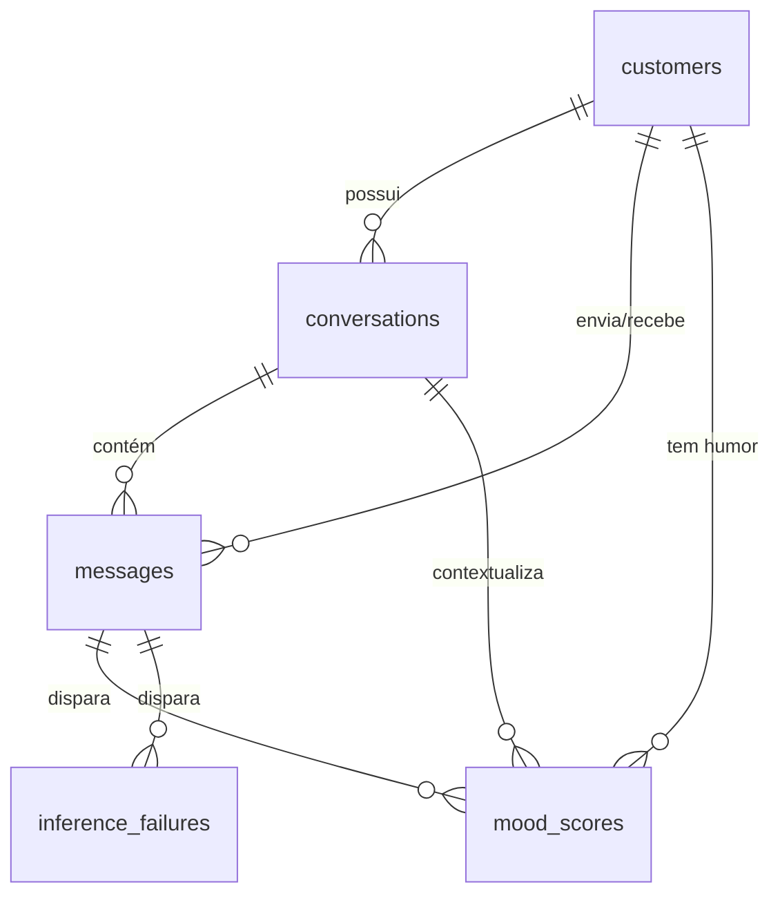

# Modelo de Dados — Análise de Humor do Cliente

Descreve a estrutura de dados que será implementada no projeto, desde a mensagem recebida pelo Backend API até o humor exibido no frontend e os artefatos usados para treinar o modelo.

Documento **prescritivo**: define entidades, esquemas, chaves e contratos entre os componentes ([mood-api/](../mood-api/), [mood-ml/](../mood-ml/), [chat-app/](../chat-app/)). As **transformações** (limpeza, mascaramento de PII, extração de features, rotulagem e mapeamento de score para categoria) são descritas apenas pelo contrato de entrada e saída. A lógica fica em aberto para implementações futuras (seção 6).

Convenções:

- **Planejado**: estrutura a implementar.
- **Scaffold atual**: o que o código já faz hoje, quando difere do planejado (seção 10).
- **Em aberto**: decisão ainda não tomada. O campo ou a tabela existe, mas o conteúdo ou a regra dependem dela.

---

## 1. Visão geral do fluxo

O modelo de dados se divide em duas trilhas que não compartilham armazenamento:

- **Trilha online (operacional):** cada mensagem é persistida no DuckDB pelo Backend API, que pede a inferência ao módulo de ML e grava o resultado.
- **Trilha offline (ML):** corpus sintético e snapshots exportados viram datasets rotulados, que geram versões de modelo. Tudo em arquivos, fora do DuckDB.

| # | Estágio | Componente | Entrada | Saída | Grão da saída |
|---|---|---|---|---|---|
| 1 | Ingestão | mood-api `POST /v1alpha1/ingest` | `IngestRequest` (HTTP) | linhas em `customers`, `conversations`, `messages` | mensagem |
| 2 | Contexto de inferência | mood-api | `messages` | `InferRequest` | mensagem disparadora + janela de histórico |
| 3 | Inferência | mood-ml `POST /internal/v1/infer` | `InferRequest` | `InferResponse` | uma inferência |
| 4 | Registro do humor | mood-api | `InferResponse` | linha em `mood_scores` ou `inference_failures` | uma inferência |
| 5 | Consulta | mood-api `GET /v1alpha1/customer/<id>/mood` | `v_customer_mood_latest` | `MoodResponse` | cliente |
| 6 | Treino (offline) | mood-ml `ingest/`, `transform/`, `train/` | corpus sintético, snapshot exportado | dataset rotulado, artefato de modelo + manifesto | exemplo de treino / versão de modelo |

```
                    TRILHA ONLINE (DuckDB, escritor único = mood-api)

chat-app ──IngestRequest──► mood-api ──► customers / conversations / messages
                               │
                               ├──InferRequest──► mood-ml (infer) ──InferResponse──┐
                               │                                                    │
                               ◄────────────────────────────────────────────────────┘
                               ├──► mood_scores (append-only)  |  inference_failures
                               │
chat-app ◄──MoodResponse─── v_customer_mood_latest

                    TRILHA OFFLINE (arquivos em mood-ml/, sem acesso ao DuckDB)

synthetic_conversations ──┐
                          ├─► [T1..T4 em aberto] ─► training_dataset ─► train ─► models/<version>/
snapshot exportado ───────┘                                                        (artefato + manifest)
```

A regra de arquitetura do [README](../README.md) governa o modelo: **só o mood-api escreve no DuckDB**. O mood-ml nunca lê nem escreve o arquivo `.duckdb`. Recebe dados por HTTP (online) ou por arquivo exportado (offline).

---

## 2. Camada 1 — Contratos de entrada e saída (HTTP)

### 2.1 `POST /v1alpha1/ingest` — `IngestRequest`

Contrato público definido no README. Os nomes dos campos são mantidos para não quebrar clientes. O mapeamento para as colunas do banco está na última coluna.

| Campo | Tipo JSON | Obrigatório | Validação | Coluna de destino |
|---|---|---|---|---|
| `conversation_id` | string | sim | não vazio | `messages.conversation_id`, `conversations.conversation_id` |
| `customer_id` | string | sim | não vazio | `messages.customer_id`, `customers.customer_id` |
| `role` | string | sim | `customer` \| `agent` | `messages.role` |
| `message` | string | sim | não vazio; tamanho máximo gera `413` (limite em aberto) | `messages.text` |
| `timestamp` | string ISO-8601 | sim | com timezone; normalizado para UTC | `messages.sent_at` |
| `customer_name` | string | não | — | `customers.display_name` (**planejado**, campo novo e opcional) |
| `client_message_id` | string | não | único por `conversation_id` | `messages.client_message_id` (**planejado**, para idempotência) |

Resposta: `200 {"status": "ok", "message_id": "<uuid>"}` quando a inferência é síncrona, ou `202` com o mesmo corpo quando for assíncrona. O `message_id` na resposta é **planejado**, para permitir correlacionar a mensagem com o humor calculado a partir dela.

### 2.2 `POST /internal/v1/infer` — contrato mood-api → mood-ml

Contrato interno, não exposto ao frontend.

`InferRequest` (**planejado**):

| Campo | Tipo JSON | Descrição |
|---|---|---|
| `request_id` | string (UUID) | Gerado pela API; permite rastrear a falha até a mensagem |
| `customer_id` | string | — |
| `conversation_id` | string | — |
| `trigger_message_id` | string (UUID) | Mensagem que disparou a inferência (sempre `role = customer`) |
| `history` | array de `HistoryMessage` | Janela de contexto, em ordem cronológica crescente, incluindo a mensagem disparadora como último item |

`HistoryMessage`:

| Campo | Tipo JSON | Descrição |
|---|---|---|
| `message_id` | string | — |
| `role` | string | `customer` \| `agent` |
| `text` | string | Texto como persistido; mascarado ou não, conforme T2 (em aberto) |
| `sent_at` | string ISO-8601 UTC | — |

> **Em aberto — janela de histórico (T5):** tamanho da janela (N mensagens, período, conversa inteira ou todas as conversas do cliente) e se mensagens `agent` entram como contexto. O contrato já transporta ambos os papéis; o modelo decide o que usar. A regra do README ("mensagens `agent` não entram no cálculo") passa a ser responsabilidade do mood-ml, e não um filtro na API.

`InferResponse` (**planejado**):

| Campo | Tipo JSON | Nulo? | Descrição |
|---|---|---|---|
| `request_id` | string | não | Eco do pedido |
| `customer_id` | string | não | Eco do pedido |
| `conversation_id` | string | não | Eco do pedido |
| `trigger_message_id` | string | não | Eco do pedido |
| `score` | number | não | Valor na escala declarada em `scale` |
| `scale` | string | não | Identificador da escala (ver 3.5) |
| `mood_label` | string | sim | Categoria discreta; `null` enquanto T6 não existir |
| `model_version` | string | não | Versão do modelo que produziu o score |
| `computed_at` | string ISO-8601 UTC | não | Momento da inferência no mood-ml |

Erro de inferência deve voltar como status HTTP de erro (`4xx`/`5xx`) com `{"error_code", "detail"}`. **Nunca** como um score neutro de fallback: um valor padrão seria indistinguível de um humor neutro real (ver 3.6).

### 2.3 `GET /v1alpha1/customer/<id>/mood` — `MoodResponse`

| Campo | Tipo JSON | Nulo? | Origem |
|---|---|---|---|
| `customer_id` | string | não | `v_customer_mood_latest.customer_id` |
| `score` | number | não | `.score` |
| `scale` | string | não | `.scale` |
| `model_version` | string | não | `.model_version` |
| `computed_at` | string ISO-8601 UTC | não | `.computed_at` |
| `conversation_id` | string | não | `.conversation_id` (**planejado**, adição compatível) |
| `mood_label` | string | sim | `.mood_label` (**planejado**, adição compatível) |

`404` quando o cliente não tem nenhuma linha em `mood_scores`. Isso também vale para o cliente que tem mensagens cujas inferências todas falharam.

---

## 3. Camada 2 — Esquema operacional (DuckDB)

Arquivo: `mood-api/data/mood.duckdb` ([connection.py](../mood-api/app/db/connection.py)). Único escritor: o processo do mood-api. Todas as datas são `TIMESTAMPTZ` gravadas em UTC.



### 3.1 `customers`

Uma linha por cliente. Criada no primeiro `ingest` do cliente (upsert).

| Coluna | Tipo | Nulo? | Restrição | Descrição |
|---|---|---|---|---|
| `customer_id` | VARCHAR | não | PK | Identificador recebido no ingest (ver seção 8 sobre pseudonimização) |
| `display_name` | VARCHAR | sim | — | Nome exibido ao atendente. PII |
| `first_seen_at` | TIMESTAMPTZ | não | — | `received_at` da primeira mensagem |
| `last_message_at` | TIMESTAMPTZ | não | — | `sent_at` da mensagem mais recente, atualizado a cada ingest |

### 3.2 `conversations`

Uma linha por conversa. Um cliente pode ter várias conversas; uma conversa pertence a exatamente um cliente.

| Coluna | Tipo | Nulo? | Restrição | Descrição |
|---|---|---|---|---|
| `conversation_id` | VARCHAR | não | PK | Recebido no ingest |
| `customer_id` | VARCHAR | não | FK → `customers` | Fixado na criação; ingest com outro `customer_id` para a mesma conversa é rejeitado com `400` |
| `started_at` | TIMESTAMPTZ | não | — | `sent_at` da primeira mensagem |
| `last_message_at` | TIMESTAMPTZ | não | — | `sent_at` da mensagem mais recente |
| `status` | VARCHAR | não | `open` \| `closed` | Padrão `open`. **Em aberto:** quem e quando encerra (inatividade, ação do atendente) |
| `closed_at` | TIMESTAMPTZ | sim | — | Preenchido quando `status = closed` |

### 3.3 `messages`

Uma linha por mensagem, dos dois papéis. Tabela **imutável**: não há `UPDATE` de texto.

| Coluna | Tipo | Nulo? | Restrição | Descrição |
|---|---|---|---|---|
| `message_id` | VARCHAR (UUID) | não | PK | Gerado pela API |
| `conversation_id` | VARCHAR | não | FK → `conversations` | — |
| `customer_id` | VARCHAR | não | FK → `customers` | Desnormalizado para consultas por cliente; sempre igual a `conversations.customer_id` |
| `role` | VARCHAR | não | `customer` \| `agent` | — |
| `text` | VARCHAR | não | — | Corpo da mensagem. Se é bruto ou mascarado depende de T2 (em aberto) |
| `sent_at` | TIMESTAMPTZ | não | — | `timestamp` informado pelo cliente. Chave de ordenação |
| `received_at` | TIMESTAMPTZ | não | padrão `now()` | Momento em que a API persistiu |
| `client_message_id` | VARCHAR | sim | UNIQUE (`conversation_id`, `client_message_id`) | Idempotência de reenvio |

Índice sugerido: (`conversation_id`, `sent_at`) para montar a janela de histórico do `InferRequest`.

### 3.4 `mood_scores` — histórico append-only

Uma linha por **inferência bem-sucedida**. Nunca é atualizada nem apagada: o humor atual é derivado (3.7), não armazenado.

| Coluna | Tipo | Nulo? | Restrição | Descrição |
|---|---|---|---|---|
| `mood_id` | VARCHAR (UUID) | não | PK | Gerado pela API |
| `request_id` | VARCHAR (UUID) | não | UNIQUE | Correlaciona com o `InferRequest` |
| `customer_id` | VARCHAR | não | FK → `customers` | — |
| `conversation_id` | VARCHAR | não | FK → `conversations` | — |
| `trigger_message_id` | VARCHAR | não | FK → `messages` | Mensagem de cliente que originou a inferência |
| `score` | DOUBLE | não | dentro dos limites de `scale` | Valor contínuo |
| `scale` | VARCHAR | não | valor de 3.5 | Escala em que `score` está expresso |
| `mood_label` | VARCHAR | sim | — | Categoria discreta opcional (T6, em aberto) |
| `model_version` | VARCHAR | não | — | Versão do modelo (manifesto em 4.4) |
| `computed_at` | TIMESTAMPTZ | não | — | Momento da inferência, informado pelo mood-ml |
| `persisted_at` | TIMESTAMPTZ | não | padrão `now()` | Momento da gravação na API |

Uma mesma mensagem pode ter mais de uma linha, por exemplo em uma reinferência com outra `model_version`. Por isso a chave natural é (`trigger_message_id`, `model_version`), e não só a mensagem.

### 3.5 Escala do humor — em aberto

A escala **não é fixada** por este modelo. A estrutura suporta qualquer escala contínua, com uma categoria discreta opcional:

- `score` é sempre `DOUBLE`.
- `scale` declara em qual escala o `score` está. Valores já reconhecidos pelo frontend ([mood.ts](../chat-app/src/utils/mood.ts)): `'-1 to 1'` e `'0 to 1'`. Uma escala nova exige atualizar a normalização no frontend.
- `mood_label` fica `null` até existir uma escala discreta. Quando existir, o domínio de valores deve ser declarado no manifesto do modelo (4.4), e não fixado no banco.
- **Invariante:** todas as linhas com a mesma `model_version` usam a mesma `scale`. Trocar a escala exige uma nova versão de modelo.
- A API valida `score` contra os limites da `scale` antes de gravar. Um valor fora dos limites vira `inference_failures` com `error_code = 'score_out_of_range'`.

### 3.6 `inference_failures`

Uma linha por inferência que não produziu score válido. Existe para que falhas não desapareçam em silêncio: sem ela, uma mensagem cuja inferência falhou é indistinguível de uma mensagem que nunca foi avaliada.

| Coluna | Tipo | Nulo? | Restrição | Descrição |
|---|---|---|---|---|
| `failure_id` | VARCHAR (UUID) | não | PK | — |
| `request_id` | VARCHAR (UUID) | não | — | — |
| `trigger_message_id` | VARCHAR | não | FK → `messages` | — |
| `model_version` | VARCHAR | sim | — | `null` se o mood-ml não chegou a responder |
| `error_code` | VARCHAR | não | — | Ex.: `timeout`, `ml_unavailable`, `invalid_response`, `score_out_of_range` |
| `detail` | VARCHAR | sim | — | Mensagem de erro, **sem** texto da conversa |
| `occurred_at` | TIMESTAMPTZ | não | padrão `now()` | — |

> **Em aberto:** política de retentativa (reprocessar falhas em lote ou descartar). O modelo de dados permite as duas coisas: uma retentativa gera um novo `request_id` e, se tiver sucesso, uma linha em `mood_scores`.

### 3.7 Views derivadas

**`v_customer_mood_latest`**: último humor por cliente. É a origem do `MoodResponse`.

```sql
CREATE VIEW v_customer_mood_latest AS
SELECT * EXCLUDE (rn) FROM (
    SELECT *, ROW_NUMBER() OVER (
        PARTITION BY customer_id ORDER BY computed_at DESC, persisted_at DESC
    ) AS rn
    FROM mood_scores
) WHERE rn = 1;
```

**`v_conversation_mood_latest`**: mesma lógica, com `PARTITION BY conversation_id`. Atende o frontend, que mostra um emoji **por conversa**.

> Com várias versões de modelo em produção ao mesmo tempo, "último" por `computed_at` pode alternar entre versões. **Em aberto:** filtrar as views por uma versão ativa, definida em configuração da API.

---

## 4. Camada 3 — Artefatos de ML (arquivos em `mood-ml/`)

O mood-ml não tem banco. Seus dados são arquivos versionados por identificador, fora do git (ver seção 8). Estrutura de diretórios planejada:

```
mood-ml/data/
  raw/synthetic/<corpus_id>.jsonl        # 4.1
  raw/snapshots/<snapshot_id>.parquet    # 4.2
  labels/<label_set_id>.parquet          # 4.3
  datasets/<dataset_id>/                 # 4.3
    train.parquet  validation.parquet  test.parquet  dataset.json
mood-ml/models/<model_version>/          # 4.4
  model.<ext>  manifest.json
```

> Parquet exige adicionar `pyarrow` ao [requirements.txt](../mood-ml/requirements.txt). Formato alternativo: CSV, com perda de tipos.

### 4.1 Corpus sintético — `raw/synthetic/<corpus_id>.jsonl`

Produzido por `generate_synthetic_conversations` ([synthetic.py](../mood-ml/ingest/synthetic.py)). Uma linha JSON por **mensagem**, no mesmo esquema de `messages`, para que o pipeline de treino trate dados sintéticos e reais da mesma forma:

| Campo | Tipo | Nulo? | Descrição |
|---|---|---|---|
| `corpus_id` | string | não | Identificador da geração |
| `conversation_id` | string | não | Prefixo `syn-` para nunca colidir com IDs reais |
| `customer_id` | string | não | Prefixo `syn-` |
| `message_id` | string | não | — |
| `role` | string | não | `customer` \| `agent` |
| `text` | string | não | — |
| `sent_at` | string ISO-8601 UTC | não | — |
| `persona` | string | sim | Perfil simulado do cliente. **Em aberto:** estratégia de geração |
| `generated_label` | number | sim | Humor "verdadeiro" atribuído pelo gerador, quando houver |

### 4.2 Snapshot de dados reais — `raw/snapshots/<snapshot_id>.parquet`

Exportação de `messages` (e opcionalmente de `mood_scores`) feita **pelo mood-api**, preservando a regra de escritor único. Tem o mesmo esquema de colunas de 3.3, mais `snapshot_id` e `exported_at`.

> **Em aberto:** mecanismo de exportação (`COPY ... TO` disparado por endpoint administrativo ou por job agendado), recorte temporal e se o texto sai já mascarado (T2).

### 4.3 Rótulos e dataset de treino

**`labels/<label_set_id>.parquet`**: ground truth, separado dos dados brutos para permitir mais de uma fonte de rótulo sobre o mesmo corpus.

| Campo | Tipo | Nulo? | Descrição |
|---|---|---|---|
| `label_set_id` | string | não | — |
| `target_type` | string | não | `message` \| `conversation`. **Em aberto:** grão do rótulo |
| `target_id` | string | não | `message_id` ou `conversation_id`, conforme `target_type` |
| `label_score` | number | não | Na escala de `scale` |
| `scale` | string | não | Mesma semântica de 3.5 |
| `label_source` | string | não | `synthetic` \| `manual` \| `heuristic` \| `csat`. **Em aberto:** fonte oficial |
| `annotator` | string | sim | Identificador pseudônimo, quando `manual` |
| `labeled_at` | string ISO-8601 UTC | não | — |

**`datasets/<dataset_id>/`**: saída de T3 + T4, entrada de `train_model` ([train.py](../mood-ml/train/train.py)). Uma linha por **exemplo** (grão = `target_type` do label set):

| Campo | Tipo | Descrição |
|---|---|---|
| `example_id` | string | = `target_id` |
| `customer_id` | string | Usado para o split |
| `conversation_id` | string | Usado para o split |
| `features` | em aberto | Vetor, colunas ou embedding. Definido por T3 e versionado por `feature_spec_version` |
| `label_score` | number | Vindo do label set |
| `split` | string | `train` \| `validation` \| `test` |

`dataset.json` registra `dataset_id`, `source_ids` (corpus e snapshots), `label_set_id`, `feature_spec_version`, `split_strategy`, `row_counts` e `created_at`.

> **Regra de split:** particionar por `customer_id`, e nunca por mensagem. Mensagens do mesmo cliente em treino e em teste vazam informação e inflam as métricas.

### 4.4 Versão de modelo — `models/<model_version>/manifest.json`

Registro de modelos. É a fonte da verdade para o valor `model_version` gravado em `mood_scores`.

```json
{
  "model_version": "mood-2026.09.0",
  "scale": "-1 to 1",
  "mood_labels": null,
  "trained_at": "2026-09-14T00:00:00Z",
  "dataset_id": "ds-2026-09-14-a",
  "feature_spec_version": "fs-0",
  "history_window": null,
  "algorithm": null,
  "metrics": {},
  "code_commit": "<git sha>"
}
```

| Campo | Descrição |
|---|---|
| `model_version` | Identificador único e imutável. Nunca é reutilizado |
| `scale` | Escala do `score` produzido (invariante de 3.5) |
| `mood_labels` | Domínio de `mood_label` com os limites de score de cada categoria, ou `null` |
| `dataset_id`, `feature_spec_version` | Rastreabilidade até os dados de treino |
| `history_window` | Janela de contexto esperada na inferência (T5). `null` = em aberto |
| `algorithm`, `metrics` | Em aberto até a arquitetura do modelo e a métrica de avaliação serem definidas |
| `code_commit` | Commit do código que treinou o modelo |

O valor placeholder `"untrained"` do scaffold ([predict.py](../mood-ml/infer/predict.py)) não deve chegar a `mood_scores` em produção.

---

## 5. Chaves, cardinalidade e identidade

```
Customer (customer_id) ──1:N── Conversation (conversation_id) ──1:N── Message (message_id)
                                                                          │
                                                        1:N ──────────────┤
                                                                          ├── MoodScore (mood_id)
                                                                          └── InferenceFailure (failure_id)
```

- **Cliente ≠ conversa.** Diferente de um modelo "um contato = uma conversa", aqui um cliente pode ter várias conversas. O humor é consultado por cliente (`MoodResponse`) e exibido por conversa (`v_conversation_mood_latest`).
- **Toda mensagem tem identidade própria** (`message_id`). A deduplicação de reenvio usa (`conversation_id`, `client_message_id`), quando informado.
- **Humor é um evento, não um estado.** A chave natural de `mood_scores` é (`trigger_message_id`, `model_version`). O estado atual é sempre derivado por view.
- **Somente mensagens `customer` disparam inferência.** Uma `agent` é persistida e pode compor o `history`, mas nunca aparece como `trigger_message_id`.
- **IDs sintéticos têm o prefixo `syn-`**, o que garante que corpus sintético e dados reais possam ser unidos sem colisão.
- **Online e offline se ligam por `model_version`.** Cada linha de `mood_scores` leva ao manifesto, ao dataset e aos rótulos que a produziram.

---

## 6. Transformações — em aberto

Cada transformação é definida apenas pelo **contrato**: onde roda, o que recebe e o que devolve. A lógica será especificada e implementada depois. Enquanto não houver implementação, vale o comportamento da coluna "Placeholder".

| ID | Transformação | Onde roda | Entrada | Saída | Placeholder | Decisões pendentes |
|---|---|---|---|---|---|---|
| T1 | Limpeza de texto | mood-ml `transform/clean.py` (`clean_message`) | `text: str` | `text: str` | `text.strip()` | Remoção de mensagens automáticas e texto padrão, normalização (caixa, acentos, emojis), mensagens vazias após a limpeza |
| T2 | Mascaramento de PII | **em aberto**: antes de persistir (mood-api) ou só no ML | `text: str` | `text: str` com marcadores | nenhum | Local de execução, tipos de PII cobertos (CPF, telefone, e-mail, nomes), formato dos marcadores |
| T3 | Extração de features | mood-ml `transform/clean.py` (`extract_features`) | lista de `HistoryMessage` | `features` (formato em aberto) | `NotImplementedError` | Features clássicas ou embeddings; o formato define `datasets/*.features` e `feature_spec_version` |
| T4 | Rotulagem | mood-ml (offline) | mensagens ou conversas | linhas de `labels` | `generated_label` do corpus sintético | Grão (`message` ou `conversation`), fonte oficial do rótulo, protocolo de anotação |
| T5 | Janela de contexto | mood-api (monta) + mood-ml (consome) | `messages` do cliente | `InferRequest.history` | só a mensagem disparadora | Tamanho da janela, inclusão de mensagens `agent`, histórico entre conversas |
| T6 | Score → categoria | mood-ml (`infer`) | `score`, `scale` | `mood_label` | `null` | Número de categorias e limites. Hoje o frontend faz esse mapeamento sozinho ([mood.ts](../chat-app/src/utils/mood.ts)) |

Invariantes que qualquer implementação futura deve respeitar:

1. T1 e T3 aplicados no treino e na inferência são **o mesmo código na mesma versão**. `feature_spec_version` no manifesto garante isso.
2. Nenhuma transformação altera linhas já gravadas em `messages` ou `mood_scores`. Um reprocessamento gera linhas novas.
3. Uma transformação que falha em uma mensagem gera `inference_failures` e nunca produz um valor padrão.

---

## 7. Consumidor: frontend (`chat-app`)

O [chat-app](../chat-app/src/App.tsx) depende destes campos:

| Uso no frontend | Campo de origem |
|---|---|
| Emoji e rótulo de humor | `MoodResponse.score`, `MoodResponse.scale` |
| Tag de versão do modelo | `MoodResponse.model_version` |
| Associação do humor à conversa | `MoodResponse.customer_id` (planejado: `conversation_id`) |
| Lista de conversas: `id`, `customerId`, `customerName`, `lastSeen` | `conversations.conversation_id`, `customer_id`, `customers.display_name`, `conversations.last_message_at` |
| Mensagens: `id`, `role`, `text`, `time` | `messages.message_id`, `role`, `text`, `sent_at` |

Renomear ou mudar o tipo de `score`, `scale` ou `model_version` quebra o frontend.

> **Em aberto:** as rotas de leitura de conversas e mensagens (hoje os dados são mockados em `App.tsx`) e o mecanismo de atualização do humor (polling, SSE ou WebSocket). O esquema de 3.1–3.3 já atende essas rotas sem alterações.

---

## 8. Tratamento de PII e armazenamento

| Dado | Onde aparece | Tratamento planejado |
|---|---|---|
| `customer_id` | todas as tabelas, artefatos de ML | Deve ser um identificador **pseudônimo** vindo do sistema de origem, e nunca telefone ou e-mail em claro. Se a origem só tiver o telefone, a API guarda um hash com segredo (HMAC). **Em aberto** |
| `display_name` | `customers` | PII. Fica só no DuckDB e **nunca** sai em snapshots ou datasets |
| `text` | `messages`, snapshots, datasets | Pode conter CPF, telefone, e-mail etc. Mascaramento em T2 (em aberto) |
| `inference_failures.detail` | DuckDB | Não pode conter trechos de mensagem |
| `annotator` | `labels` | Pseudônimo |

Armazenamento fora do git: `mood-api/data/`, `mood-ml/data/` e `mood-ml/models/` devem estar no [.gitignore](../.gitignore).

> **Em aberto (README, "Ética e Privacidade"):** base legal para uso de dados reais, política de retenção (prazo de expurgo de `messages` e snapshots) e se `mood_scores` sobrevive ao expurgo do texto que o originou.

---

## 9. Decisões em aberto que afetam o modelo

| Decisão | Estruturas afetadas | Estado atual no modelo |
|---|---|---|
| Escala do humor | `score`, `scale`, `mood_label`, `manifest.mood_labels` | Estrutura genérica; nenhuma escala fixada |
| Grão do rótulo | `labels.target_type`, `datasets` | Suporta `message` e `conversation` |
| Janela de histórico (T5) | `InferRequest.history`, `manifest.history_window` | Contrato transporta a janela; tamanho indefinido |
| Local do mascaramento (T2) | `messages.text`, snapshots | Indefinido; ver seção 8 |
| Versão ativa do modelo | `v_*_mood_latest` | Views não filtram por versão |
| Encerramento de conversa | `conversations.status`, `closed_at` | Colunas existem; regra indefinida |
| Inferência síncrona ou assíncrona | resposta `200`/`202` do ingest | Ambos previstos; `inference_failures` cobre falhas nos dois modos |
| Retentativa de falhas | `inference_failures` | Permitida pelo modelo; política indefinida |
| Formato de `features` | `datasets/*` | Indefinido |

---

## 10. Divergências entre o scaffold atual e o modelo planejado

| # | Scaffold atual | Planejado | Arquivo |
|---|---|---|---|
| 1 | Não há tabelas `customers` e `conversations` | Tabelas 3.1 e 3.2, com FKs | [connection.py](../mood-api/app/db/connection.py) |
| 2 | `messages` com colunas `id`, `message`, `timestamp` | `message_id`, `text`, `sent_at`, mais `received_at` e `client_message_id` | [connection.py](../mood-api/app/db/connection.py) |
| 3 | `TIMESTAMP` sem timezone | `TIMESTAMPTZ` em UTC | [connection.py](../mood-api/app/db/connection.py) |
| 4 | `mood_scores` com PK `customer_id`, que sobrescreve o humor anterior | Append-only com `mood_id` + views de humor atual | [connection.py](../mood-api/app/db/connection.py), [routes.py](../mood-api/app/api/routes.py) |
| 5 | Não há registro de falhas de inferência | Tabela `inference_failures` | — |
| 6 | `InferRequest` envia só a mensagem, sem `message_id` nem histórico | `request_id`, `trigger_message_id`, `history` | [predict.py](../mood-ml/infer/predict.py) |
| 7 | `InferResponse` não ecoa conversa, mensagem nem pedido; placeholder `score=0.0`, `scale="neutral"` | Ecos + `mood_label`; erro via HTTP, nunca score padrão | [predict.py](../mood-ml/infer/predict.py) |
| 8 | Mocks do frontend usam `scale` `'0 to 1'` e `'-1 to 1'`, mas a barra de humor sempre assume `-1..1` | Barra normalizada pela mesma função de `mood.ts` | [App.tsx](../chat-app/src/App.tsx) |
| 9 | Resposta do ingest não devolve `message_id` | `{"status", "message_id"}` | [routes.py](../mood-api/app/api/routes.py) |
