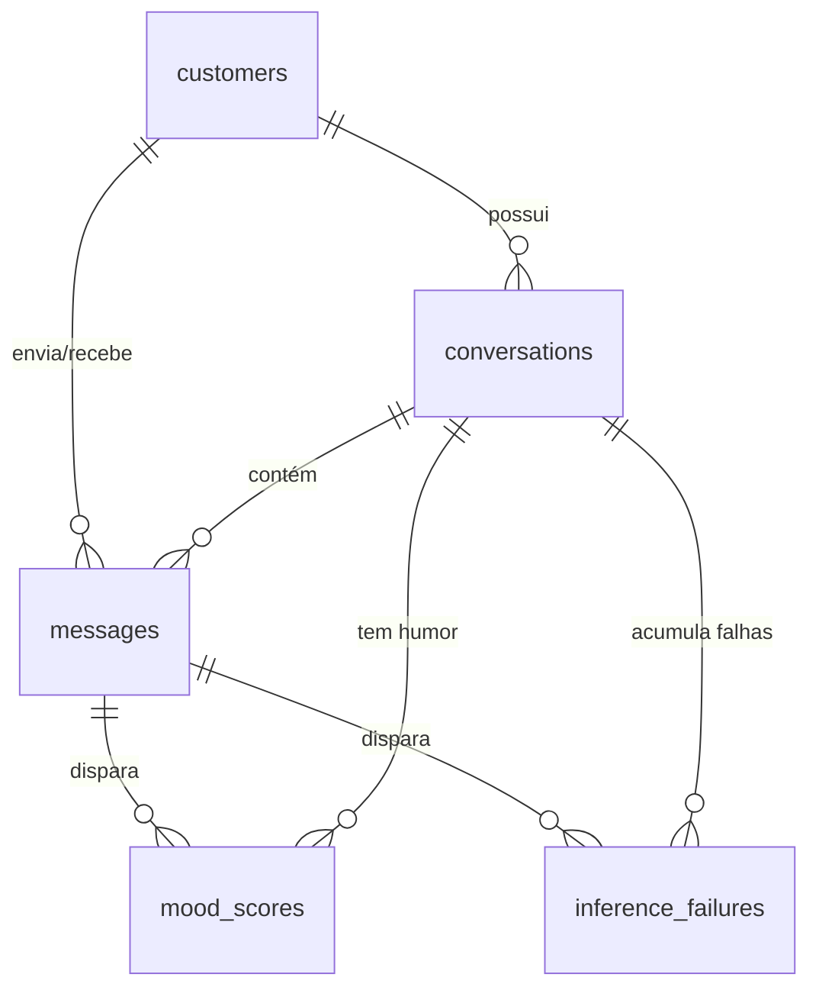

# Modelo de Dados — Análise de Humor do Cliente

Descreve a estrutura de dados que será implementada no projeto, desde a mensagem recebida pelo Backend API até o humor exibido no frontend e os artefatos usados para treinar o modelo.

Documento **prescritivo**: define entidades, esquemas, chaves e contratos entre os componentes ([mood-api/](../mood-api/), [mood-ml/](../mood-ml/), [chat-app/](../chat-app/)). Está subordinado à [constituição](../decisions/constitution.md) e reflete os ADRs aceitos em [decisions/](../decisions/).

Convenções:

- **Planejado**: estrutura a implementar.
- **Decidido (ADR-000N)**: regra fechada por ADR aceito. Alterá-la exige um novo ADR que marque o anterior como *superseded*.
- **Em aberto**: decisão ainda não tomada. O campo ou a tabela existe, mas o conteúdo ou a regra dependem dela (inventário em 9.2).
- **Scaffold atual**: o que o código já faz hoje, quando difere do planejado (seção 10).

---

## 0. Constituição e decisões vigentes

Os princípios da [constituição](../decisions/constitution.md) são invioláveis; este modelo existe para torná-los verificáveis no esquema.

| Princípio | O que impõe ao modelo de dados | Onde aparece |
|---|---|---|
| **P1** — Escritor único no DuckDB | Só o mood-api escreve o `.duckdb`. O mood-ml recebe dados por HTTP (online) ou arquivo exportado (offline) | 1, 3, 4.2 |
| **P2** — `mood_scores` é append-only | Sem `UPDATE`/`DELETE`; humor atual é derivado por view | 3.4, 3.7 |
| **P3** — Nunca gravar score de fallback | Falha vira `inference_failures`; `model_version` de placeholder é rejeitada | 2.2, 3.6 |
| **P4** — T1 e T3 idênticos no treino e na inferência | `feature_spec_version` e `history_window` no manifesto amarram o contrato de features | 4.4, 6 |
| **P5** — Nenhum dado com PII sai do DuckDB | `display_name` fora de snapshots/datasets; `detail` sem texto de conversa; `customer_id` pseudônimo | 3.6, 4.2, 8 |

ADRs vigentes:

| ADR | Decisão | Seções afetadas |
|---|---|---|
| [ADR-0001](../decisions/ADR-0001-escala-do-humor.md) | Escala contínua `-1 to 1`, `mood_label` nulo no MVP | 2.2, 2.3, 3.4, 3.5, 6 (T6) |
| [ADR-0002](../decisions/ADR-0002-origem-do-ground-truth.md) | Ground truth do MVP é o `generated_label` sintético | 4.1, 4.3, 6 (T4) |
| [ADR-0004](../decisions/ADR-0004-retentativa-e-quarentena.md) | Retentativa absorvida pela próxima mensagem; quarentena após 3 falhas | 2.3, 3.6, 3.7 |
| [ADR-0006](../decisions/ADR-0006-sem-encerramento-no-mvp.md) | Duas rotas públicas; encerramento de conversa fora do MVP | 2.1, 3.2, 7 |
| [ADR-0007](../decisions/ADR-0007-humor-por-conversa.md) | Humor pertence à conversa; janela de 30 mensagens `customer` **da conversa** | 2.2, 2.3, 3.3, 3.4, 3.7, 4.4, 6 (T5) |
| [ADR-0008](../decisions/ADR-0008-abordagens-de-modelo.md) | T3 em dois blocos (disparadora + contexto); abordagem A (TF-IDF + Ridge) primeiro, C (embeddings congelados + Ridge) depois | 4.3, 4.4, 6 (T3), 9 |

Substituídos, mantidos apenas como registro histórico: [ADR-0003](../decisions/ADR-0003-ciclo-de-vida-da-conversa.md) (ciclo de vida com encerramento) por ADR-0006, e [ADR-0005](../decisions/ADR-0005-janela-de-historico.md) (janela com escopo de cliente) por ADR-0007.

---

## 1. Visão geral do fluxo

O modelo de dados se divide em duas trilhas que não compartilham armazenamento:

- **Trilha online (operacional):** cada mensagem é persistida no DuckDB pelo Backend API, que pede a inferência ao módulo de ML e grava o resultado.
- **Trilha offline (ML):** o corpus sintético vira dataset rotulado, que gera versões de modelo. Tudo em arquivos, fora do DuckDB.

| # | Estágio | Componente | Entrada | Saída | Grão da saída |
|---|---|---|---|---|---|
| 1 | Ingestão | mood-api `POST /v1alpha1/ingest` | `IngestRequest` (HTTP) | linhas em `customers`, `conversations`, `messages` | mensagem |
| 2 | Contexto de inferência | mood-api | `messages` da conversa | `InferRequest` | até 30 mensagens `customer` da conversa |
| 3 | Inferência | mood-ml `POST /internal/v1/infer` | `InferRequest` | `InferResponse` | uma inferência |
| 4 | Registro do humor | mood-api | `InferResponse` | linha em `mood_scores` ou `inference_failures` | uma inferência (humor da **conversa**) |
| 5 | Consulta | mood-api `GET /v1alpha1/customer/<id>/mood` | `v_customer_mood_latest` | `MoodResponse` | conversa mais recentemente pontuada do cliente |
| 6 | Treino (offline) | mood-ml `ingest/`, `transform/`, `train/` | corpus sintético | dataset rotulado, artefato de modelo + manifesto | exemplo de treino / versão de modelo |

**São duas rotas públicas** (ADR-0006): `POST /v1alpha1/ingest` e `GET /v1alpha1/customer/<id>/mood`.

```
                    TRILHA ONLINE (DuckDB, escritor único = mood-api)   [P1]

chat-app ──IngestRequest──► mood-api ──► customers / conversations / messages
                               │
                               │  só role=customer dispara inferência
                               ├──InferRequest──► mood-ml (infer) ──InferResponse──┐
                               │   (30 msgs customer DA CONVERSA)                   │
                               ◄────────────────────────────────────────────────────┘
                               ├──► mood_scores (append-only, humor da conversa) [P2]
                               └──► inference_failures (erro ou quarentena) [P3]

chat-app ◄──MoodResponse─── v_customer_mood_latest

                    TRILHA OFFLINE (arquivos em mood-ml/, sem acesso ao DuckDB)

synthetic_conversations ─► [T1, T3] ─► training_dataset ─► train ─► models/<version>/
  (+ generated_label = T4)                                          (artefato + manifest)
```

---

## 2. Camada 1 — Contratos de entrada e saída (HTTP)

### 2.1 `POST /v1alpha1/ingest` — `IngestRequest`

Contrato público definido no README. Os nomes dos campos são mantidos para não quebrar clientes. O mapeamento para as colunas do banco está na última coluna.

| Campo | Tipo JSON | Obrigatório | Validação | Coluna de destino |
|---|---|---|---|---|
| `conversation_id` | string | sim | não vazio | `messages.conversation_id`, `conversations.conversation_id` |
| `customer_id` | string | sim | não vazio | `messages.customer_id`, `customers.customer_id` |
| `role` | string | sim | `customer` \| `agent` | `messages.role` |
| `message` | string | sim | não vazio; tamanho máximo gera `413` (limite em aberto) | `messages.text` |
| `timestamp` | string ISO-8601 | sim | com timezone; normalizado para UTC | `messages.sent_at` |
| `customer_name` | string | não | — | `customers.display_name` (**planejado**, campo novo e opcional) |
| `client_message_id` | string | não | único por `conversation_id` | `messages.client_message_id` (**planejado**, para idempotência) |

Respostas:

| Status | Quando |
|---|---|
| `200 {"status": "ok", "message_id": "<uuid>"}` | Mensagem persistida, inferência síncrona concluída |
| `202` (mesmo corpo) | Mensagem persistida, inferência assíncrona |
| `400` | Payload inválido, ou `customer_id` diferente do dono da conversa |
| `413` | Mensagem acima do tamanho máximo |
| `422` | **Decidido (ADR-0006):** `role = 'agent'` para um `conversation_id` inexistente. O atendente responde a um atendimento, nunca o inicia |

Regras de efeito, **decididas (ADR-0006 e ADR-0007)**:

- `role = 'customer'` em conversa inexistente **cria** a conversa (`status = 'open'`, valor fixo — ver 3.2).
- **Só `role = 'customer'` dispara inferência.** Mensagens `agent` são persistidas e nada mais.
- Conversa em quarentena (ADR-0004) persiste a mensagem e grava `inference_failures` com `error_code = 'quarantined'`, sem chamar o mood-ml.

### 2.2 `POST /internal/v1/infer` — contrato mood-api → mood-ml

Contrato interno, não exposto ao frontend.

`InferRequest` (**planejado**):

| Campo | Tipo JSON | Descrição |
|---|---|---|
| `request_id` | string (UUID) | Gerado pela API; permite rastrear a falha até a mensagem |
| `customer_id` | string | — |
| `conversation_id` | string | Conversa da mensagem disparadora |
| `trigger_message_id` | string (UUID) | Mensagem que disparou a inferência (sempre `role = customer`) |
| `history` | array de `HistoryMessage` | Janela de contexto (ver abaixo), ordem cronológica crescente, com a mensagem disparadora como último item. Tamanho entre 1 e 30 |

`HistoryMessage`:

| Campo | Tipo JSON | Descrição |
|---|---|---|
| `message_id` | string | — |
| `role` | string | `customer` \| `agent`. No MVP sempre `customer` |
| `text` | string | Texto como persistido; mascarado ou não, conforme T2 (em aberto) |
| `sent_at` | string ISO-8601 UTC | — |

> **Decidido (ADR-0007) — janela de histórico (T5):** as **30 mensagens `customer` mais recentes da conversa** da mensagem disparadora. A janela **não atravessa** `conversation_id`: mensagens de outras conversas do mesmo cliente ficam de fora, mesmo sendo recentes. Mensagens `agent` **não entram**, e o filtro é aplicado **na API**, ao montar o `InferRequest` — em favor de P5 (menos PII em trânsito) e de um payload menor, ao custo de acoplar a API a uma escolha de modelagem. O campo `role` permanece no contrato para permitir reativar contexto de atendente sem mudar o esquema.
>
> A janela é parte da especificação de features: por P4, mudar tamanho **ou escopo** exige nova `model_version`, e `history_window` e `history_scope` no manifesto devem bater com o comportamento da API (divergência impede subir o serviço).
>
> **Toda conversa nova começa com `len(history) == 1`** — não é caso de borda de cliente novo, é o início de todo atendimento. O modelo precisa se comportar razoavelmente nessa condição.

`InferResponse` (**planejado**):

| Campo | Tipo JSON | Nulo? | Descrição |
|---|---|---|---|
| `request_id` | string | não | Eco do pedido |
| `customer_id` | string | não | Eco do pedido |
| `conversation_id` | string | não | Eco do pedido |
| `trigger_message_id` | string | não | Eco do pedido |
| `score` | number | não | **Decidido (ADR-0001):** contínuo em `[-1.0, 1.0]` |
| `scale` | string | não | **Decidido (ADR-0001):** sempre `'-1 to 1'` |
| `mood_label` | string | sim | **Decidido (ADR-0001):** `null` no MVP; T6 fora de escopo |
| `model_version` | string | não | Versão do modelo que produziu o score |
| `computed_at` | string ISO-8601 UTC | não | Momento da inferência no mood-ml |

**P3:** erro de inferência volta como status HTTP `4xx`/`5xx` com `{"error_code", "detail"}`. **Nunca** como score neutro de fallback — um valor padrão seria indistinguível de um humor neutro real.

### 2.3 `GET /v1alpha1/customer/<id>/mood` — `MoodResponse`

| Campo | Tipo JSON | Nulo? | Origem |
|---|---|---|---|
| `customer_id` | string | não | `v_customer_mood_latest.customer_id` |
| `score` | number | não | `.score` |
| `scale` | string | não | `.scale` (sempre `'-1 to 1'`) |
| `model_version` | string | não | `.model_version` |
| `computed_at` | string ISO-8601 UTC | não | `.computed_at` |
| `conversation_id` | string | **não** | `.conversation_id` — **obrigatório (ADR-0007)**: identifica a conversa a que o score pertence |
| `mood_label` | string | sim | `.mood_label` (**planejado**, `null` no MVP) |

**Decidido (ADR-0007) — o que esta rota devolve:** o humor pertence à **conversa**, mas a rota é por cliente. Ela devolve o score da **conversa mais recentemente pontuada** desse cliente, e `conversation_id` diz qual é. Um cliente com duas conversas ativas tem dois humores; esta rota expõe um deles, e o consumidor precisa tratar isso (ver 7).

**Decidido (ADR-0004) — comportamento durante falha:** a rota devolve sempre o **último score bem-sucedido**, mesmo que as inferências mais recentes estejam falhando ou a conversa esteja em quarentena. Nada de `503` e nada de valor neutro. `404` só quando o cliente não tem **nenhuma** linha em `mood_scores` — inclusive quando todas as suas inferências falharam.

Esse comportamento é emergente: como `mood_scores` é append-only (P2) e falha não grava nada, a view já devolve o último válido sem código adicional.

> **Limitação assumida:** o humor pode estar obsoleto sem que a resposta diga isso. O campo `computed_at` já permite ao frontend sinalizar obsolescência (ver 7); o limiar está em aberto.

> **Não existe rota de encerramento de conversa (ADR-0006).** O MVP tem exatamente estas duas rotas públicas.

---

## 3. Camada 2 — Esquema operacional (DuckDB)

Arquivo: `mood-api/data/mood.duckdb` ([connection.py](../mood-api/app/db/connection.py)). Único escritor: o processo do mood-api (**P1**). Todas as datas são `TIMESTAMPTZ` gravadas em UTC.

Duas naturezas de tabela convivem aqui, e a diferença é deliberada:

- **Dimensões mutáveis** (`customers`, `conversations`): guardam estado atual, com `UPDATE`. Sem encerramento de conversa (ADR-0006), o único campo que muda depois da criação é `last_message_at`.
- **Fatos imutáveis** (`messages`, `mood_scores`, `inference_failures`): append-only. P2 vale para `mood_scores`; as outras duas seguem a mesma disciplina por coerência.



### 3.1 `customers`

Uma linha por cliente. Criada no primeiro `ingest` do cliente (upsert).

| Coluna | Tipo | Nulo? | Restrição | Descrição |
|---|---|---|---|---|
| `customer_id` | VARCHAR | não | PK | Identificador recebido no ingest; pseudônimo por P5 (ver seção 8) |
| `display_name` | VARCHAR | sim | — | Nome exibido ao atendente. PII: nunca sai do DuckDB |
| `first_seen_at` | TIMESTAMPTZ | não | — | `received_at` da primeira mensagem |
| `last_message_at` | TIMESTAMPTZ | não | — | `sent_at` da mensagem mais recente, atualizado a cada ingest |

### 3.2 `conversations`

Uma linha por conversa. Um cliente pode ter várias conversas; uma conversa pertence a exatamente um cliente. Depois da criação, só `last_message_at` muda.

| Coluna | Tipo | Nulo? | Restrição | Descrição |
|---|---|---|---|---|
| `conversation_id` | VARCHAR | não | PK | Recebido no ingest |
| `customer_id` | VARCHAR | não | FK → `customers` | Fixado na criação; ingest com outro `customer_id` para a mesma conversa é rejeitado com `400` |
| `started_at` | TIMESTAMPTZ | não | — | `sent_at` da primeira mensagem |
| `last_message_at` | TIMESTAMPTZ | não | — | `sent_at` da mensagem mais recente. Critério de ordenação da lista de conversas |
| `status` | VARCHAR | não | sempre `'open'` | **Coluna reservada (ADR-0006)** |
| `closed_at` | TIMESTAMPTZ | sim | sempre `null` | **Coluna reservada (ADR-0006)** |

Ciclo de vida, **decidido (ADR-0006)**:

| Evento | Efeito |
|---|---|
| Primeiro `ingest` com `role = 'customer'` | Cria a conversa com `status = 'open'`, `closed_at = null` |
| `ingest` com `role = 'agent'` em conversa inexistente | Rejeitado com `422`; nada é criado |

**Não há encerramento de conversa no MVP** e, por consequência, não há reabertura nem conversa em estado `closed`. `status` e `closed_at` existem apenas para que a feature possa voltar sem migração de esquema.

**Proibido:** criar conversa a partir de mensagem `agent`; escrever `status` ou `closed_at` com qualquer valor fora de `'open'` e `null` enquanto não houver ADR que reviva o encerramento.

`status` **não** representa quarentena de inferência: quarentena é estado derivado de `inference_failures` (ver 3.6), nunca coluna.

### 3.3 `messages`

Uma linha por mensagem, dos dois papéis. Tabela **imutável**: não há `UPDATE` de texto.

| Coluna | Tipo | Nulo? | Restrição | Descrição |
|---|---|---|---|---|
| `message_id` | VARCHAR (UUID) | não | PK | Gerado pela API |
| `conversation_id` | VARCHAR | não | FK → `conversations` | — |
| `customer_id` | VARCHAR | não | FK → `customers` | Desnormalizado para consultas por cliente; sempre igual a `conversations.customer_id` |
| `role` | VARCHAR | não | `customer` \| `agent` | Só `customer` dispara inferência |
| `text` | VARCHAR | não | — | Corpo da mensagem. Se é bruto ou mascarado depende de T2 (em aberto) |
| `sent_at` | TIMESTAMPTZ | não | — | `timestamp` informado pelo cliente. Chave de ordenação |
| `received_at` | TIMESTAMPTZ | não | padrão `now()` | Momento em que a API persistiu |
| `client_message_id` | VARCHAR | sim | UNIQUE (`conversation_id`, `client_message_id`) | Idempotência de reenvio |

Índices, **decididos (ADR-0007)**:

| Índice | Para quê |
|---|---|
| (`conversation_id`, `role`, `sent_at`) | **Obrigatório.** Monta a janela de 30 mensagens `customer` da conversa. Sem ele, a consulta vira scan à medida que `messages` cresce |
| (`conversation_id`, `sent_at`) | Listagem de mensagens da conversa no frontend |

Os dois têm o mesmo prefixo: a janela e a contagem de quarentena (3.7) passaram a filtrar pela mesma coluna, o que era o descompasso deixado pelo escopo de cliente do ADR-0005.

### 3.4 `mood_scores` — histórico append-only (P2)

Uma linha por **inferência bem-sucedida**. Nunca é atualizada nem apagada: o humor atual é derivado (3.7), não armazenado.

| Coluna | Tipo | Nulo? | Restrição | Descrição |
|---|---|---|---|---|
| `mood_id` | VARCHAR (UUID) | não | PK | Gerado pela API |
| `request_id` | VARCHAR (UUID) | não | UNIQUE | Correlaciona com o `InferRequest` |
| `customer_id` | VARCHAR | não | FK → `customers` | Desnormalizado; sustenta a rota de humor por cliente |
| `conversation_id` | VARCHAR | não | FK → `conversations` | **Grão semântico da linha (ADR-0007):** o score é o humor desta conversa |
| `trigger_message_id` | VARCHAR | não | FK → `messages` | Mensagem `customer` que originou a inferência |
| `score` | DOUBLE | não | `BETWEEN -1.0 AND 1.0` | **Decidido (ADR-0001)** |
| `scale` | VARCHAR | não | `'-1 to 1'` no MVP | Escala em que `score` está expresso |
| `mood_label` | VARCHAR | sim | — | `null` no MVP (T6 fora de escopo) |
| `model_version` | VARCHAR | não | ≠ `'untrained'` (P3) | Versão do modelo (manifesto em 4.4) |
| `computed_at` | TIMESTAMPTZ | não | — | Momento da inferência, informado pelo mood-ml |
| `persisted_at` | TIMESTAMPTZ | não | padrão `now()` | Momento da gravação na API |

Uma mesma mensagem pode ter mais de uma linha, por exemplo em uma reinferência com outra `model_version`. Por isso a chave natural é (`trigger_message_id`, `model_version`), e não só a mensagem.

**Grão (ADR-0007):** cada linha é o humor de uma **conversa** em um instante, calculado só a partir de mensagens daquela conversa. Duas conversas do mesmo cliente produzem séries independentes.

> **Limitação assumida (ADR-0004): `mood_scores` não é registro completo por mensagem.** Como a retentativa é absorvida pela mensagem seguinte, a mensagem que falhou nunca ganha linha própria — o `trigger_message_id` do sucesso posterior é o da mensagem nova. Qualquer análise de cobertura precisa cruzar `messages` com `mood_scores` **e** `inference_failures`.

### 3.5 Escala do humor — decidida (ADR-0001)

Escala **contínua `-1 to 1`**, fixada para todo o MVP:

- `score` é `DOUBLE` em `[-1.0, 1.0]`, limites inclusivos.
- Semântica: o **sinal** indica direção (negativo = insatisfeito, positivo = satisfeito), o **módulo** indica intensidade, **zero é neutro**.
- `scale = '-1 to 1'` em `mood_scores`, no `InferResponse` e no manifesto do modelo. É o valor que [mood.ts](../chat-app/src/utils/mood.ts) já trata sem normalização.
- `mood_label` permanece `null`: a transformação T6 (score → categoria) está fora do escopo do MVP, e o frontend continua mapeando score para emoji sozinho.
- **Invariante:** todas as linhas com a mesma `model_version` usam a mesma `scale`. Por P2, trocar de escala não é `UPDATE`: exige treinar e publicar nova `model_version`, e as linhas antigas permanecem na escala que declararam.
- A API valida o intervalo **antes** de gravar. Score fora de `[-1.0, 1.0]` vira `inference_failures` com `error_code = 'score_out_of_range'` — é esse limite que impede uma resposta corrompida do mood-ml de entrar como humor válido.

**Consequência para o ML:** o problema é de **regressão**, não de classificação. `manifest.metrics` deve carregar MAE ou RMSE; acurácia não se aplica.

### 3.6 `inference_failures`

Uma linha por inferência que não produziu score válido (**P3**). Existe para que falhas não desapareçam em silêncio: sem ela, uma mensagem cuja inferência falhou é indistinguível de uma mensagem que nunca foi avaliada.

| Coluna | Tipo | Nulo? | Restrição | Descrição |
|---|---|---|---|---|
| `failure_id` | VARCHAR (UUID) | não | PK | — |
| `request_id` | VARCHAR (UUID) | não | — | Gerado mesmo quando o mood-ml não chega a ser chamado |
| `trigger_message_id` | VARCHAR | não | FK → `messages` | — |
| `conversation_id` | VARCHAR | não | FK → `conversations` | **Decidido (ADR-0004):** desnormalizado, para que a contagem de quarentena não exija JOIN com `messages` |
| `model_version` | VARCHAR | sim | — | `null` se o mood-ml não chegou a responder |
| `error_code` | VARCHAR | não | domínio abaixo | — |
| `detail` | VARCHAR | sim | sem PII (P5) | Mensagem de erro, **sem** texto da conversa |
| `occurred_at` | TIMESTAMPTZ | não | padrão `now()` | — |

Domínio de `error_code`:

| Valor | Significado | Conta para quarentena? |
|---|---|---|
| `timeout` | mood-ml não respondeu a tempo | sim |
| `ml_unavailable` | Falha de conexão com o mood-ml | sim |
| `invalid_response` | Resposta fora do contrato de 2.2 | sim |
| `score_out_of_range` | `score` fora de `[-1.0, 1.0]` (ADR-0001) | sim |
| `quarantined` | Inferência não tentada por quarentena ativa | **não** |

**Decidido (ADR-0004) — retentativa e quarentena:**

- **Sem job, fila ou agendador.** A retentativa é absorvida pela próxima mensagem do cliente: a mensagem que falhou já está em `messages` e entra na janela de histórico da inferência seguinte. Cada tentativa gera um `request_id` novo.
- **Quarentena após 3 falhas consecutivas** por conversa, contadas desde a última inferência bem-sucedida. Um sucesso zera a contagem.
- Em quarentena: mensagens continuam sendo **persistidas normalmente**, nenhuma inferência é tentada, e cada mensagem grava `error_code = 'quarantined'` para preservar a trilha.
- O estado de quarentena é **derivado por consulta** (3.7), nunca armazenado — guardar um contador criaria uma segunda fonte da verdade, capaz de divergir de `inference_failures`.
- Saída da quarentena é **manual** e está fora do escopo do MVP.

### 3.7 Views e consultas derivadas

**`v_conversation_mood_latest`**: humor atual de cada conversa. É a view **primária**, porque o humor pertence à conversa (ADR-0007).

```sql
CREATE VIEW v_conversation_mood_latest AS
SELECT * EXCLUDE (rn) FROM (
    SELECT *, ROW_NUMBER() OVER (
        PARTITION BY conversation_id ORDER BY computed_at DESC, persisted_at DESC
    ) AS rn
    FROM mood_scores
) WHERE rn = 1;
```

**`v_customer_mood_latest`**: humor da **conversa mais recentemente pontuada** de cada cliente. Existe para sustentar a rota por cliente, que o ADR-0006 manteve como uma das duas públicas. Não é uma agregação do cliente: é a linha de uma conversa específica, e `conversation_id` diz qual.

```sql
CREATE VIEW v_customer_mood_latest AS
SELECT * EXCLUDE (rn) FROM (
    SELECT *, ROW_NUMBER() OVER (
        PARTITION BY customer_id ORDER BY computed_at DESC, persisted_at DESC
    ) AS rn
    FROM mood_scores
) WHERE rn = 1;
```

**Quarentena (ADR-0004)**: falhas consecutivas da conversa desde a última inferência bem-sucedida. Roda a cada ingest de `customer`, antes de chamar o mood-ml; a partir de 3, a inferência não é tentada.

```sql
SELECT count(*)
FROM inference_failures f
WHERE f.conversation_id = ?
  AND f.error_code <> 'quarantined'
  AND f.occurred_at > coalesce(
        (SELECT max(persisted_at) FROM mood_scores WHERE conversation_id = ?),
        '-infinity'::TIMESTAMPTZ
      );
```

> Esta é a versão já com `conversation_id` desnormalizado em `inference_failures`; sem a coluna, a mesma contagem exige JOIN com `messages`.

> **Em aberto:** com várias versões de modelo ativas ao mesmo tempo, "último" por `computed_at` pode alternar entre versões. Filtrar as views por uma versão ativa definida em configuração da API continua em aberto.

---

## 4. Camada 3 — Artefatos de ML (arquivos em `mood-ml/`)

O mood-ml não tem banco (**P1**). Seus dados são arquivos versionados por identificador, fora do git (**P5**, ver seção 8). Estrutura de diretórios planejada:

```
mood-ml/data/
  raw/synthetic/<corpus_id>.jsonl        # 4.1
  raw/snapshots/<snapshot_id>.parquet    # 4.2 — pós-MVP
  labels/<label_set_id>.parquet          # 4.3
  datasets/<dataset_id>/                 # 4.3
    train.parquet  validation.parquet  test.parquet  dataset.json
mood-ml/models/<model_version>/          # 4.4
  model.<ext>  manifest.json
```

> Parquet exige adicionar `pyarrow` ao [requirements.txt](../mood-ml/requirements.txt). Formato alternativo: CSV, com perda de tipos.

### 4.1 Corpus sintético — `raw/synthetic/<corpus_id>.jsonl`

Chega pronto e é validado contra o contrato `dc-1` ([01-dataset-contract.md](../mood-ml/specs/01-dataset-contract.md)) pelo `ingest/validate.py`. O gerador [synthetic.py](../mood-ml/ingest/synthetic.py) está deprecado. **Decidido (ADR-0002):** é a única fonte de dados de treino do MVP. Uma linha JSON por **mensagem**, no mesmo esquema de `messages`, para que o pipeline trate dados sintéticos e reais da mesma forma:

| Campo | Tipo | Nulo? | Descrição |
|---|---|---|---|
| `corpus_id` | string | não | Identificador da geração |
| `conversation_id` | string | não | Prefixo `syn-`, para nunca colidir com IDs reais |
| `customer_id` | string | não | Prefixo `syn-` |
| `message_id` | string | não | — |
| `role` | string | não | `customer` \| `agent` |
| `text` | string | não | — |
| `sent_at` | string ISO-8601 UTC | não | — |
| `persona` | string | **não** | Perfil simulado do cliente, definido **antes** do texto |
| `generated_label` | number | **não** em `role = 'customer'` | Humor verdadeiro em `[-1.0, 1.0]`. É o ground truth do MVP |

O gerador define persona e trajetória emocional da conversa **antes** de escrever o texto: o rótulo nasce junto com o dado, e não é inferido depois. Mensagens `agent` sintéticas podem ter `generated_label` nulo, já que não são alvo de predição.

> **Em aberto:** a estratégia de geração de personas e trajetórias, a ser fixada na spec do corpus sintético (fase F3). A qualidade do modelo fica limitada pela qualidade do gerador — investir em realismo das personas rende mais que investir no algoritmo.

### 4.2 Snapshot de dados reais — `raw/snapshots/<snapshot_id>.parquet`

**Pós-MVP.** Exportação de `messages` (e opcionalmente de `mood_scores`) feita **pelo mood-api**, preservando P1. Mesmo esquema de colunas de 3.3, mais `snapshot_id` e `exported_at`, e **sem** `display_name`, excluído por construção (P5).

> **Em aberto:** mecanismo de exportação (`COPY ... TO` por endpoint administrativo ou job agendado), recorte temporal e se o texto sai já mascarado (T2).

### 4.3 Rótulos e dataset de treino

**`labels/<label_set_id>.parquet`**: ground truth, separado dos dados brutos para permitir mais de uma fonte de rótulo sobre o mesmo corpus.

| Campo | Tipo | Nulo? | Valor no MVP (ADR-0002) |
|---|---|---|---|
| `label_set_id` | string | não | — |
| `target_type` | string | não | `message` |
| `target_id` | string | não | `message_id` |
| `label_score` | number | não | `generated_label`, em `[-1.0, 1.0]` |
| `scale` | string | não | `'-1 to 1'` (ADR-0001) |
| `label_source` | string | não | `synthetic`. Domínio completo: `synthetic` \| `manual` \| `heuristic` \| `csat` |
| `annotator` | string | sim | `null` |
| `labeled_at` | string ISO-8601 UTC | não | — |

Trocar a fonte de rótulo no futuro (`manual`, `csat`) **não exige mudança estrutural**: gera-se um novo `label_set_id` e um novo `dataset_id`.

**`datasets/<dataset_id>/`**: saída de T3 aplicada sobre o corpus, com o rótulo de T4. Entrada de `train_model` ([train.py](../mood-ml/train/train.py)). Uma linha por **exemplo** (grão de mensagem, no MVP):

| Campo | Tipo | Descrição |
|---|---|---|
| `example_id` | string | = `target_id` |
| `customer_id` | string | Usado para o split |
| `conversation_id` | string | Rastreabilidade |
| `persona` | string | Do corpus. Sustenta as métricas por persona (análise de viés) |
| `text_clean` | string | Bloco **texto** de T3: mensagem disparadora após T1 + T2 (ADR-0008) |
| `context_clean` | lista de string | Bloco **contexto** de T3: até 29 mensagens `customer` anteriores da conversa, após T1 + T2, em ordem crescente. Lista vazia no início da conversa (ADR-0008) |
| `label_score` | number | Vindo do label set |
| `split` | string | `train` \| `validation` \| `test` |

`dataset.json` registra `dataset_id`, `source_ids` (corpus e snapshots), `label_set_id`, `feature_spec_version`, `split_strategy`, `row_counts` e `created_at`.

> **Decidido (ADR-0008):** `datasets/*` guarda **texto**, nunca vetores. A vetorização vive dentro do artefato do modelo, e por isso as abordagens A e C treinam sobre o mesmo `dataset_id`. No treino, o `history` de cada exemplo é reconstruído do corpus com a mesma regra da API (T5) e passa pela mesma `extract_features` usada na inferência.

> **Regra de split:** particionar por `customer_id`, e nunca por mensagem. Com ground truth sintético (ADR-0002) isso fica ainda mais crítico: personas repetidas entre treino e teste vazam o padrão do gerador, e a métrica passa a medir memorização.

### 4.4 Versão de modelo — `models/<model_version>/manifest.json`

Registro de modelos. É a fonte da verdade para o valor `model_version` gravado em `mood_scores`.

```json
{
  "model_version": "mood-2026.09.0",
  "scale": "-1 to 1",
  "mood_labels": null,
  "trained_at": "2026-09-17T00:00:00Z",
  "dataset_id": "ds-2026-09-17-a",
  "label_set_id": "ls-2026-09-17-syn",
  "feature_spec_version": "fs-0",
  "history_window": 30,
  "history_scope": "conversation",
  "algorithm": "tfidf-ridge",
  "metrics": { "mae": null, "rmse": null, "spearman": null },
  "code_commit": "<git sha>"
}
```

| Campo | Obrigatório | Descrição |
|---|---|---|
| `model_version` | sim | Identificador único e imutável. Nunca é reutilizado |
| `scale` | sim | `'-1 to 1'` (ADR-0001). Invariante por versão |
| `mood_labels` | sim | `null` no MVP |
| `dataset_id`, `label_set_id`, `feature_spec_version` | sim | Rastreabilidade até os dados e as features de treino |
| `history_window`, `history_scope` | sim | `30` e `"conversation"` (ADR-0007). **Conferidos no carregamento do modelo**: divergência em relação ao comportamento da API viola P4 e impede subir o serviço |
| `metrics` | sim | Métricas de **regressão** (MAE, RMSE, Spearman). Acurácia não se aplica (ADR-0001) |
| `algorithm` | sim | `"tfidf-ridge"` (abordagem A) ou `"embeddings-ridge"` (abordagem C), conforme ADR-0008. Identifica a vetorização, que vive dentro do artefato |
| `code_commit` | sim | Commit do código que treinou o modelo |

O placeholder `"untrained"` do scaffold ([predict.py](../mood-ml/infer/predict.py)) nunca pode chegar a `mood_scores` (P3).

> **Limitação metodológica a declarar no TCC (ADR-0002):** treinado e avaliado sobre corpus sintético, o modelo aprende a função do gerador, não o humor humano. As métricas serão altas, e isso não é mérito do modelo. Nenhum número produzido sobre o corpus sintético é evidência de desempenho em conversas reais. A validação honesta — anotar manualmente cerca de cinquenta conversas reais e medir a correlação com o score do modelo — está fora do escopo do MVP, e até existir o modelo não deve ser apresentado como validado.

---

## 5. Chaves, cardinalidade e identidade

```
Customer (customer_id) ──1:N── Conversation (conversation_id) ──1:N── Message (message_id)
                                                                          │
                                                        1:N ──────────────┤
                                                                          ├── MoodScore (mood_id)
                                                                          └── InferenceFailure (failure_id)
```

- **O humor pertence à conversa** (ADR-0007). É calculado só com mensagens da conversa, gravado com `conversation_id` e exibido por conversa. A rota pública é por cliente apenas porque o MVP tem duas rotas (ADR-0006), e devolve a conversa mais recentemente pontuada.
- **Um cliente pode ter vários humores ao mesmo tempo**, um por conversa ativa. Nenhum deles é "o humor do cliente": não existe agregação por cliente no modelo.
- **A janela não atravessa conversas.** Conversa nova começa sem contexto, mesmo para cliente antigo — o sinal entre atendimentos foi abandonado de propósito (ADR-0007).
- **Conversa não tem ciclo de vida** (ADR-0006): nasce na primeira mensagem `customer` e não é encerrada nem reaberta.
- **Toda mensagem tem identidade própria** (`message_id`). A deduplicação de reenvio usa (`conversation_id`, `client_message_id`), quando informado.
- **Humor é um evento, não um estado** (P2). A chave natural de `mood_scores` é (`trigger_message_id`, `model_version`); o estado atual é sempre derivado por view.
- **Só mensagens `customer` disparam inferência.** Uma `agent` é persistida, mas nunca aparece como `trigger_message_id` nem entra na janela de histórico do MVP.
- **Nem toda mensagem `customer` tem score.** Falha e quarentena quebram a correspondência 1:1 com `mood_scores` (ADR-0004).
- **IDs sintéticos têm o prefixo `syn-`**, o que garante que corpus sintético e dados reais possam coexistir sem colisão.
- **Online e offline se ligam por `model_version`.** Cada linha de `mood_scores` leva ao manifesto, ao dataset, ao label set e à janela que a produziram.

---

## 6. Transformações

Cada transformação é definida pelo **contrato**: onde roda, o que recebe e o que devolve. T3, T4, T5 e T6 foram fechadas por ADR; T1 e T2 seguem em aberto e valem pelo comportamento da coluna "Placeholder / Regra" até serem especificadas.

| ID | Transformação | Status | Onde roda | Entrada → Saída | Placeholder / Regra |
|---|---|---|---|---|---|
| T1 | Limpeza de texto | **em aberto** | mood-ml `transform/clean.py` (`clean_message`) | `text: str` → `text: str` | `text.strip()`. Pendente: remoção de mensagens automáticas, normalização (caixa, acentos, emojis), texto vazio após limpeza |
| T2 | Mascaramento de PII | **em aberto** | indefinido: antes de persistir (mood-api) ou só no ML | `text: str` → `text` com marcadores | nenhum. Pendente: local de execução, tipos cobertos (CPF, telefone, e-mail, nomes), formato dos marcadores |
| T3 | Extração de features | **decidida (ADR-0008)** | mood-ml `transform/features.py` (`extract_features`) | lista de `HistoryMessage` → `text_clean` + `context_clean` | T1 + T2 em cada item. `text_clean` = disparadora; `context_clean` = itens anteriores (até 29). A vetorização (TF-IDF na abordagem A, embeddings na C) vive no artefato do modelo |
| T4 | Rotulagem | **decidida (ADR-0002)** | mood-ml, no gerador sintético | persona + trajetória → `generated_label` | `label_source = 'synthetic'`, `target_type = 'message'`, escala `-1 to 1`. O rótulo nasce com o dado |
| T5 | Janela de contexto | **decidida (ADR-0007)** | mood-api (monta) → mood-ml (consome) | `messages` da conversa → `InferRequest.history` | 30 mensagens `customer` mais recentes da **conversa**, ordem crescente, `agent` filtrado na API |
| T6 | Score → categoria | **fora do escopo (ADR-0001)** | — | `score` → `mood_label` | `mood_label = null`. O frontend faz o mapeamento para emoji ([mood.ts](../chat-app/src/utils/mood.ts)) |

Invariantes que qualquer implementação futura deve respeitar:

1. **P4:** T1 e T3 aplicados no treino e na inferência são o mesmo código, na mesma versão, importado de um único módulo. `feature_spec_version`, `history_window` e `history_scope` no manifesto declaram o vínculo e são conferidos ao carregar o modelo.
2. **P2:** nenhuma transformação altera linhas já gravadas em `messages` ou `mood_scores`. Reprocessamento gera linhas novas.
3. **P3:** transformação que falha gera `inference_failures` e nunca produz valor padrão.
4. **ADR-0007:** mudar o tamanho **ou o escopo** da janela exige nova `model_version` — a janela é especificação de features, não parâmetro operacional. Compor a janela com mensagens de outra conversa é proibido.

---

## 7. Consumidor: frontend (`chat-app`)

O [chat-app](../chat-app/src/App.tsx) depende destes campos:

| Uso no frontend | Campo de origem |
|---|---|
| Emoji e rótulo de humor | `MoodResponse.score`, `MoodResponse.scale` (sempre `'-1 to 1'`) |
| Barra de humor | mesmo par, normalizado pela mesma função que produz o emoji |
| Tag de versão do modelo | `MoodResponse.model_version` |
| Indicador de humor obsoleto | `MoodResponse.computed_at` (ADR-0004) |
| A que conversa o humor pertence | `MoodResponse.conversation_id` (obrigatório, ADR-0007) |
| Ordenação da lista de conversas | `conversations.last_message_at` |
| Lista de conversas: `id`, `customerId`, `customerName`, `lastSeen` | `conversations.conversation_id`, `customer_id`, `customers.display_name`, `conversations.last_message_at` |
| Mensagens: `id`, `role`, `text`, `time` | `messages.message_id`, `role`, `text`, `sent_at` |

Renomear ou mudar o tipo de `score`, `scale` ou `model_version` quebra o frontend.

**Regra de exibição (ADR-0007):** o humor é da conversa, e a rota devolve o de **uma** conversa. O emoji só pode ser exibido na conversa cujo `id` for igual ao `conversation_id` da resposta; nas demais conversas do mesmo cliente, o frontend mostra um **estado vazio**, nunca o score recebido. Repetir o mesmo emoji em todas as conversas do cliente exibiria ao atendente um humor que não foi calculado para aquele atendimento.

**Estado vazio ≠ humor neutro.** `404` significa "ainda não há humor calculado" e não pode virar 😐: um emoji neutro reintroduziria na interface o score de fallback que P3 proíbe no banco. O vazio precisa ser visualmente distinto de qualquer valor da escala.

**Indicador de obsolescência (ADR-0004):** como a API devolve o último humor válido mesmo durante falhas, o frontend deve derivar de `computed_at` um sinal visual quando o score passar de um limiar de idade. Não altera o contrato, apenas usa um campo existente. O limiar está em aberto.

> **Sem separação ativos × histórico (ADR-0006):** como não há encerramento de conversa, a lista é ordenada por `last_message_at` e cresce indefinidamente.

> **Em aberto:** rotas de leitura de conversas e mensagens (hoje mockadas em `App.tsx`) e mecanismo de atualização do humor (polling, SSE ou WebSocket). O esquema de 3.1–3.3 já atende essas rotas sem alterações.

---

## 8. Tratamento de PII e armazenamento (P5)

| Dado | Onde aparece | Tratamento |
|---|---|---|
| `customer_id` | todas as tabelas, artefatos de ML | Sempre **pseudônimo**, nunca telefone ou e-mail em claro. Se a origem só tiver telefone, a API guarda hash com segredo (HMAC). **Em aberto:** o mecanismo |
| `display_name` | `customers` | PII. Só no DuckDB; excluído por construção de snapshots e datasets |
| `text` | `messages`, snapshots, datasets | Pode conter CPF, telefone, e-mail. Mascaramento em T2 (em aberto) |
| `text` de `agent` | `messages` | Não trafega no `InferRequest`: a janela só leva mensagens `customer` (ADR-0007), o que reduz PII em trânsito |
| `inference_failures.detail` | DuckDB | Nunca contém trechos de mensagem. Logs de erro carregam `message_id`, nunca `text` |
| `annotator` | `labels` | Pseudônimo. `null` no MVP |
| Corpus sintético | `raw/synthetic/` | Sem PII por construção — os artefatos de ML do MVP nascem em conformidade com P5 |

Armazenamento fora do git (verificação de P5): `mood-api/data/`, `mood-ml/data/` e `mood-ml/models/` devem estar no [.gitignore](../.gitignore).

> **Em aberto (README, "Ética e Privacidade"):** base legal para uso de dados reais, política de retenção (prazo de expurgo de `messages` e snapshots) e se `mood_scores` sobrevive ao expurgo do texto que o originou.

---

## 9. Estado das decisões

### 9.1 Fechadas

| Decisão | ADR | Como está no modelo |
|---|---|---|
| Escala do humor | [0001](../decisions/ADR-0001-escala-do-humor.md) | Contínua `-1 to 1`, limites inclusivos, `mood_label` nulo |
| Métrica de avaliação | [0001](../decisions/ADR-0001-escala-do-humor.md) | Regressão: MAE/RMSE em `manifest.metrics` |
| Ground truth | [0002](../decisions/ADR-0002-origem-do-ground-truth.md) | `generated_label` sintético, `label_source = 'synthetic'` |
| Grão do rótulo | [0002](../decisions/ADR-0002-origem-do-ground-truth.md) | `target_type = 'message'` |
| Retentativa de falhas | [0004](../decisions/ADR-0004-retentativa-e-quarentena.md) | Absorvida pela próxima mensagem; sem job nem fila |
| Comportamento durante falha | [0004](../decisions/ADR-0004-retentativa-e-quarentena.md) | Último score válido; `404` só sem nenhum score |
| Quarentena | [0004](../decisions/ADR-0004-retentativa-e-quarentena.md) | 3 falhas consecutivas por conversa, estado derivado por consulta |
| Rotas públicas | [0006](../decisions/ADR-0006-sem-encerramento-no-mvp.md) | Duas: `ingest` e `customer/<id>/mood` |
| Ciclo de vida da conversa | [0006](../decisions/ADR-0006-sem-encerramento-no-mvp.md) | Abertura por `customer`; sem encerramento; `status`/`closed_at` reservadas |
| Grão do humor | [0007](../decisions/ADR-0007-humor-por-conversa.md) | Conversa; `conversation_id` obrigatório no `MoodResponse` |
| Janela de histórico (T5) | [0007](../decisions/ADR-0007-humor-por-conversa.md) | 30 mensagens `customer` da conversa, `agent` filtrado na API |
| Formato de `features` (T3) | [0008](../decisions/ADR-0008-abordagens-de-modelo.md) | Dois blocos de texto (`text_clean`, `context_clean`) em `datasets/*`; vetorização no artefato |
| Arquitetura do modelo | [0008](../decisions/ADR-0008-abordagens-de-modelo.md) | A (TF-IDF + Ridge) primeiro, C (embeddings congelados + Ridge) depois; baseline `DummyRegressor` |

### 9.2 Em aberto

| Decisão | Estruturas afetadas | Estado atual |
|---|---|---|
| Regras de limpeza (T1) | `messages.text` no pipeline | Só `strip()` |
| Local do mascaramento (T2) | `messages.text`, snapshots | Indefinido; ver seção 8 |
| Encoder da abordagem C | T3, dependências do mood-ml | Fixado na spec de T3 quando C começar (ADR-0008) |
| Estratégia de geração de personas | `corpus.persona`, qualidade do modelo | Spec da fase F3 |
| Pseudonimização de `customer_id` | `customers`, todos os artefatos | Mecanismo (HMAC?) indefinido |
| Versão ativa do modelo | `v_*_mood_latest`, `mood-ml/models/active.json` | Views não filtram por versão; escolha entre A e C em ADR posterior (ADR-0008) |
| Saída da quarentena | `inference_failures` | Manual, fora do escopo do MVP |
| Limiar de obsolescência do humor | frontend, via `computed_at` | Indefinido |
| Limite de 3 falhas configurável por ambiente | política de quarentena | Constante por ora |
| Inferência síncrona ou assíncrona | resposta `200`/`202` do ingest | Ambas previstas |
| Tamanho máximo de mensagem | `413` no ingest | Indefinido |
| Ponderação por recência na janela | T3 | Em aberto |
| Exportação de snapshots | `raw/snapshots/` | Pós-MVP |
| Sinal entre atendimentos | feature derivada no `InferRequest` | Perdido com o escopo de conversa; mitigação futura (ADR-0007) |
| Rota de humor por conversa | rotas públicas | Só se o frontend precisar de várias conversas ao mesmo tempo |
| Volta do encerramento de conversa | `conversation_events` append-only | Fora do MVP (ADR-0006) |
| Autenticação entre serviços | superfície pública | Indefinida (README) |

---

## 10. Divergências entre o scaffold atual e o modelo planejado

| # | Scaffold atual | Planejado | Arquivo |
|---|---|---|---|
| 1 | Não há tabelas `customers` e `conversations` | Tabelas 3.1 e 3.2, com FKs e a criação de conversa do ADR-0006 | [connection.py](../mood-api/app/db/connection.py) |
| 2 | `messages` com colunas `id`, `message`, `timestamp` | `message_id`, `text`, `sent_at`, mais `received_at` e `client_message_id` | [connection.py](../mood-api/app/db/connection.py) |
| 3 | `TIMESTAMP` sem timezone | `TIMESTAMPTZ` em UTC | [connection.py](../mood-api/app/db/connection.py) |
| 4 | `mood_scores` com PK `customer_id`, que sobrescreve o humor anterior | Append-only com `mood_id` + views de humor atual (P2) | [connection.py](../mood-api/app/db/connection.py), [routes.py](../mood-api/app/api/routes.py) |
| 5 | Não há registro de falhas nem quarentena | `inference_failures` com `conversation_id` e consulta de quarentena (P3, ADR-0004) | — |
| 6 | `InferRequest` envia só a mensagem, sem `message_id` nem histórico | `request_id`, `trigger_message_id`, `history` de até 30 mensagens `customer` da conversa (ADR-0007) | [predict.py](../mood-ml/infer/predict.py) |
| 7 | `InferResponse` não ecoa conversa, mensagem nem pedido; placeholder `score=0.0`, `scale="neutral"` | Ecos + `scale = '-1 to 1'`; erro via HTTP, nunca score padrão (P3, ADR-0001) | [predict.py](../mood-ml/infer/predict.py) |
| 8 | Mocks do frontend usam `'0 to 1'` e `'-1 to 1'`, e a barra sempre assume `-1..1` | Escala única `-1 to 1`; barra normalizada pela mesma função do emoji | [App.tsx](../chat-app/src/App.tsx), [api.ts](../chat-app/src/services/api.ts) |
| 9 | Resposta do ingest não devolve `message_id` | `{"status", "message_id"}` | [routes.py](../mood-api/app/api/routes.py) |
| 10 | `ingest` não distingue papéis: tudo é persistido e nada dispara inferência | `agent` em conversa inexistente → `422`; só `customer` dispara inferência (ADR-0006) | [routes.py](../mood-api/app/api/routes.py) |
| 11 | `GET /mood` não devolve `conversation_id` | Campo obrigatório na resposta (ADR-0007) | [routes.py](../mood-api/app/api/routes.py), [schemas.py](../mood-api/app/models/schemas.py) |
| 12 | Nenhum índice declarado | `(conversation_id, role, sent_at)` obrigatório para montar a janela (ADR-0007) | [connection.py](../mood-api/app/db/connection.py) |
| 13 | `clean_message` e `extract_features` vivem em `transform/`, sem vínculo com o treino | Módulo único importado pelo treino e pela inferência, com `feature_spec_version` conferido no load (P4) | [clean.py](../mood-ml/transform/clean.py), [features.py](../mood-ml/transform/features.py), [predict.py](../mood-ml/infer/predict.py) |

O documento e o [README](../README.md) concordam quanto às duas rotas públicas e ao humor por conversa. O que resta no README é detalhe de contrato — `conversation_id` na resposta, semântica do `404` e o `422` na lista de erros —, corrigido junto com esta revisão.
